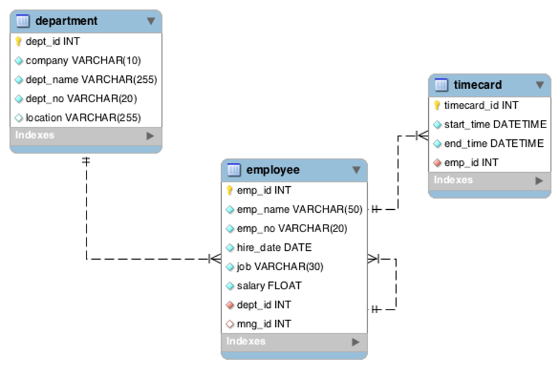
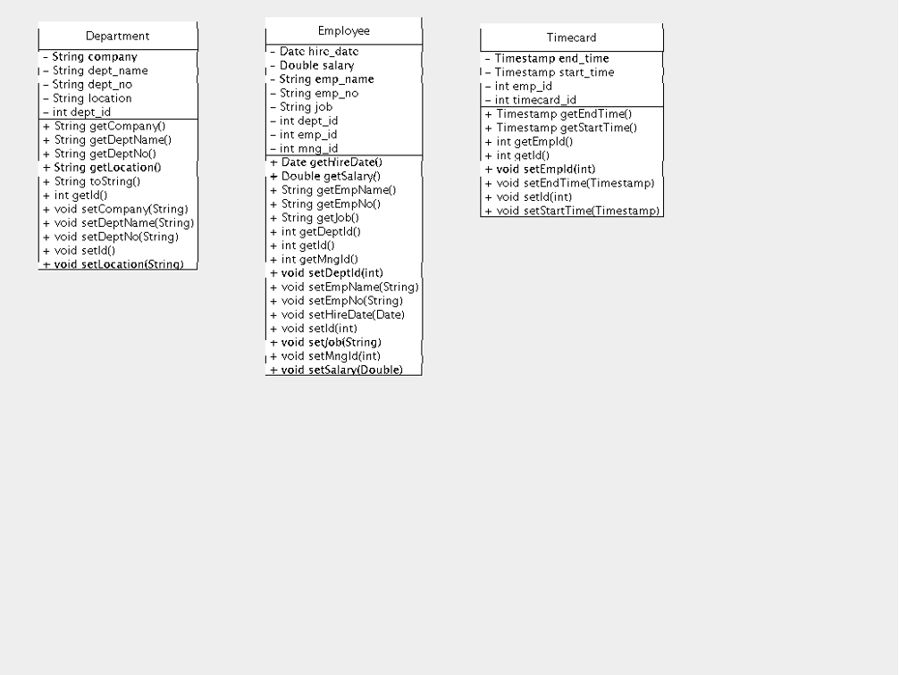

# Timecard Tracker Service

## Table of Contents

1. [Overview](#overview)
2. [Getting Started](#getting-started)
3. [Service Layer](#service-layer)
    - [Description](#description)
    - [Root Path](#root-path)
    - [Base URL Example](#base-url-example)
4. [Data Layer Documentation](#data-layer-documentation)
    - [Description](#description-1)
    - [Table Structure](#table-structure)
    - [Models](#models)
    - [Methods](#methods)
        - [Company Operations](#company-operations)
        - [Department Operations](#department-operations)
        - [Employee Operations](#employee-operations)
        - [Timecard Operations](#timecard-operations)
        - [Connection Management](#connection-management)
    - [Usage Example](#usage-example)
5. [OpenAPI Specification](#openapi-specification)
6. [Hints](#hints)
7. [Rubric](#rubric)
8. [Deliverables](#deliverables)

---

## Overview

The **Timecard Tracker Service** is a RESTful API developed in Java to help companies track employee timecards. It leverages a provided **Data Layer** for database interactions and includes comprehensive validation within the **Business Layer**. The service supports operations on companies, departments, employees, and timecards, ensuring data integrity and adherence to business rules.

---

## Getting Started

1. **Accept the Assignment**
   - Use the invite link provided on myCourses to accept the assignment.
   - Refresh the page to access starter files.

2. **Clone the Repository**
   ```bash
   cd ~/Developer
   git clone <repository-url>
   ```

3. **Configure the Project**
   - Update `pom.xml` to match your Java SDK version.

4. **Build and Deploy**
   - Use Maven to clean, compile, and package the project.
   - Deploy the generated WAR file to Wildfly.
   - Access the service at:
     ```
     http://127.0.0.1:8080/<your-war-name>/webapi/CompanyServices
     ```
   - Ensure the response `"got it"` is received.

5. **Implement the Service**
   - Define endpoints in `MyResource.java` using `@Path`, `@Produces`, `@Consumes`, etc.
   - Complete the Service and Business Layers as per the specifications.

---

## Service Layer

### Description

The Service Layer exposes various endpoints to manage companies, departments, employees, and timecards. All responses are in JSON format, and appropriate validations are enforced to maintain data consistency. This layer interacts with the Data Layer to perform CRUD operations and handle business logic.

### Root Path

```
/CompanyServices
```

### Base URL Example

```
http://localhost:8080/FrenchBP2/webapi/CompanyServices/
```

---

## Data Layer Documentation

### Description

The **companydata** Data Layer provides methods to interact with the underlying database, handling CRUD operations for companies, departments, employees, and timecards. It ensures database constraints are respected and manages connections efficiently.

### Table Structure

The employee table has two foreign keys:
1. `mng_id` references `employee.emp_id`
2. `dept_id` references `department.dept_id`

The employee table has an additional unique index on `emp_no` besides the primary key.

The timecard table has one foreign key:
1. `emp_id` references `employee.emp_id`

The department table has one additional unique index on `dept_no` besides the primary key.



### Models

The Data Layer includes the following model classes, each equipped with multiple constructors to facilitate various initialization scenarios.



#### Employee

- `Employee(String emp_name, String emp_no, Date hire_date, String job, Double salary, int dept_id, int mng_id)`

  Creates a new `Employee` instance without specifying an `emp_id`.

- `Employee(int emp_id, String emp_name, String emp_no, Date hire_date, String job, Double salary, int dept_id, int mng_id)`

  Creates a new `Employee` instance with a specified `emp_id`.

#### Department

- `Department(String company, String dept_name, String dept_no, String location)`

  Creates a new `Department` instance with all primary attributes.

- `Department(int dept_id, String company, String dept_name, String dept_no, String location)`

  Creates a new `Department` instance with a specified `dept_id`.

- `Department(String company, int dept_id)`

  Creates a `Department` instance by specifying only the company and department ID.

- `Department()`

  Creates a `Department` instance with default values (no-argument constructor).

#### Timecard

- `Timecard(Timestamp start_time, Timestamp end_time, int emp_id)`

  Creates a new `Timecard` instance without specifying a `timecard_id`.

- `Timecard(int timecard_id, Timestamp start_time, Timestamp end_time, int emp_id)`

  Creates a new `Timecard` instance with a specified `timecard_id`.

- `Timecard()`

  Creates a `Timecard` instance with default values (no-argument constructor).

### Methods

All methods in the Data Layer throw an exception if there is an error, such as the requested object not existing.

#### Company Operations

- **`int deleteCompany(String companyName)`**

  Deletes all Departments, Employees, and Timecards associated with the specified company.

  **Parameters:**
  - `companyName` (`String`): The name of the company to delete.

  **Returns:**
  - `int`: The number of rows deleted.

  **Throws:**
  - `Exception`: If an error occurs or the company does not exist.

#### Department Operations

- **`Department insertDepartment(Department department)`**

  Inserts a new Department into the database.

  **Parameters:**
  - `department` (`Department`): The Department object to insert.

  **Returns:**
  - `Department`: The inserted Department object, potentially with an updated ID.

  **Throws:**
  - `Exception`: If an error occurs or the department data is invalid.

- **`List<Department> getAllDepartment(String companyName)`**

  Retrieves all Departments for the specified company.

  **Parameters:**
  - `companyName` (`String`): The name of the company whose departments are to be retrieved.

  **Returns:**
  - `List<Department>`: A list of Department objects.

  **Throws:**
  - `Exception`: If an error occurs or the company does not exist.

- **`Department getDepartment(String companyName, int dept_id)`**

  Retrieves a specific Department by its ID for the given company.

  **Parameters:**
  - `companyName` (`String`): The name of the company.
  - `dept_id` (`int`): The ID of the department to retrieve.

  **Returns:**
  - `Department`: The requested Department object.

  **Throws:**
  - `Exception`: If an error occurs or the department does not exist.

- **`Department getDepartmentNo(String companyName, String dept_no)`**

  Retrieves a specific Department by its number for the given company.

  **Parameters:**
  - `companyName` (`String`): The name of the company.
  - `dept_no` (`String`): The number of the department to retrieve.

  **Returns:**
  - `Department`: The requested Department object.

  **Throws:**
  - `Exception`: If an error occurs or the department does not exist.

- **`Department updateDepartment(Department department)`**

  Updates an existing Department's information.

  **Parameters:**
  - `department` (`Department`): The Department object containing updated information.

  **Returns:**
  - `Department`: The updated Department object.

  **Throws:**
  - `Exception`: If an error occurs or the department does not exist.

- **`int deleteDepartment(String company, int dept_id)`**

  Deletes a specific Department for the given company.

  **Parameters:**
  - `company` (`String`): The name of the company.
  - `dept_id` (`int`): The ID of the department to delete.

  **Returns:**
  - `int`: The number of rows deleted.

  **Throws:**
  - `Exception`: If an error occurs or the department does not exist.

#### Employee Operations

- **`Employee insertEmployee(Employee employee)`**

  Inserts a new Employee into the database.

  **Parameters:**
  - `employee` (`Employee`): The Employee object to insert.

  **Returns:**
  - `Employee`: The inserted Employee object, potentially with an updated ID.

  **Throws:**
  - `Exception`: If an error occurs or the employee data is invalid.

- **`List<Employee> getAllEmployee(String companyName)`**

  Retrieves all Employees for the specified company.

  **Parameters:**
  - `companyName` (`String`): The name of the company whose employees are to be retrieved.

  **Returns:**
  - `List<Employee>`: A list of Employee objects.

  **Throws:**
  - `Exception`: If an error occurs or the company does not exist.

- **`Employee getEmployee(int emp_id)`**

  Retrieves a specific Employee by their ID.

  **Parameters:**
  - `emp_id` (`int`): The ID of the employee to retrieve.

  **Returns:**
  - `Employee`: The requested Employee object.

  **Throws:**
  - `Exception`: If an error occurs or the employee does not exist.

- **`Employee updateEmployee(Employee employee)`**

  Updates an existing Employee's information.

  **Parameters:**
  - `employee` (`Employee`): The Employee object containing updated information.

  **Returns:**
  - `Employee`: The updated Employee object.

  **Throws:**
  - `Exception`: If an error occurs or the employee does not exist.

- **`int deleteEmployee(int emp_id)`**

  Deletes a specific Employee.

  **Parameters:**
  - `emp_id` (`int`): The ID of the employee to delete.

  **Returns:**
  - `int`: The number of rows deleted.

  **Throws:**
  - `Exception`: If an error occurs or the employee does not exist.

#### Timecard Operations

- **`Timecard insertTimecard(Timecard timecard)`**

  Inserts a new Timecard into the database.

  **Parameters:**
  - `timecard` (`Timecard`): The Timecard object to insert.

  **Returns:**
  - `Timecard`: The inserted Timecard object, potentially with an updated ID.

  **Throws:**
  - `Exception`: If an error occurs or the timecard data is invalid.

- **`List<Timecard> getAllTimecard(int emp_id)`**

  Retrieves all Timecards for a specific Employee.

  **Parameters:**
  - `emp_id` (`int`): The ID of the employee whose timecards are to be retrieved.

  **Returns:**
  - `List<Timecard>`: A list of Timecard objects.

  **Throws:**
  - `Exception`: If an error occurs or the employee does not exist.

- **`Timecard getTimecard(int timecard_id)`**

  Retrieves a specific Timecard by its ID.

  **Parameters:**
  - `timecard_id` (`int`): The ID of the timecard to retrieve.

  **Returns:**
  - `Timecard`: The requested Timecard object.

  **Throws:**
  - `Exception`: If an error occurs or the timecard does not exist.

- **`Timecard updateTimecard(Timecard timecard)`**

  Updates an existing Timecard's information.

  **Parameters:**
  - `timecard` (`Timecard`): The Timecard object containing updated information.

  **Returns:**
  - `Timecard`: The updated Timecard object.

  **Throws:**
  - `Exception`: If an error occurs or the timecard does not exist.

- **`int deleteTimecard(int timecard_id)`**

  Deletes a specific Timecard.

  **Parameters:**
  - `timecard_id` (`int`): The ID of the timecard to delete.

  **Returns:**
  - `int`: The number of rows deleted.

  **Throws:**
  - `Exception`: If an error occurs or the timecard does not exist.

#### Connection Management

- **`void close()`**

  Closes the current data layer connection.

  **Throws:**
  - `Exception`: If an error occurs while closing the connection.

### Usage Example

```java
import companydata.*;

DataLayer dl = null;

try {
     dl = new DataLayer("yourusername");
     // Call desired DataLayer methods
} catch (Exception e) {
    // Handle exceptions
} finally {
     dl.close();
}
```

---

## OpenAPI Specification

```yaml
openapi: 3.0.0
info:
  title: Timecard Tracker API
  version: 1.0.0
servers:
  - url: http://localhost:8080/FrenchBP2/webapi/CompanyServices
paths:
  /company:
    delete:
      summary: Delete Company Data
      description: Deletes all Department, Employee, and Timecard records for the given company.
      parameters:
        - in: query
          name: company
          required: true
          schema:
            type: string
          description: RIT user ID as company name (e.g., company=companyName)
      responses:
        '200':
          description: Company data deleted successfully
          content:
            application/json:
              schema:
                type: object
                properties:
                  success:
                    type: string
                    example: "companyName's information deleted."
        '400':
          description: Error occurred while deleting company data
          content:
            application/json:
              schema:
                $ref: '#/components/schemas/Error'
  /department:
    get:
      summary: Get Department by ID
      description: Returns the requested Department as a JSON object.
      parameters:
        - in: query
          name: company
          required: true
          schema:
            type: string
          description: RIT user ID as company name
        - in: query
          name: dept_id
          required: true
          schema:
            type: integer
          description: Department record ID
      responses:
        '200':
          description: Department details retrieved successfully
          content:
            application/json:
              schema:
                oneOf:
                  - $ref: '#/components/schemas/Department'
                  - $ref: '#/components/schemas/Error'
        '400':
          description: Error occurred while retrieving department
          content:
            application/json:
              schema:
                $ref: '#/components/schemas/Error'
    post:
      summary: Create a New Department
      description: Creates a new Department record.
      requestBody:
        required: true
        content:
          application/x-www-form-urlencoded:
            schema:
              $ref: '#/components/schemas/DepartmentInput'
      responses:
        '201':
          description: Department created successfully
          content:
            application/json:
              schema:
                oneOf:
                  - $ref: '#/components/schemas/SuccessDepartment'
                  - $ref: '#/components/schemas/Error'
        '400':
          description: Error occurred while creating department
          content:
            application/json:
              schema:
                $ref: '#/components/schemas/Error'
    put:
      summary: Update an Existing Department
      description: Updates an existing Department record.
      requestBody:
        required: true
        content:
          application/json:
            schema:
              $ref: '#/components/schemas/Department'
      responses:
        '200':
          description: Department updated successfully
          content:
            application/json:
              schema:
                oneOf:
                  - $ref: '#/components/schemas/SuccessDepartment'
                  - $ref: '#/components/schemas/Error'
        '400':
          description: Error occurred while updating department
          content:
            application/json:
              schema:
                $ref: '#/components/schemas/Error'
    delete:
      summary: Delete a Department
      description: Deletes a specific Department record.
      parameters:
        - in: query
          name: company
          required: true
          schema:
            type: string
          description: RIT user ID as company name
        - in: query
          name: dept_id
          required: true
          schema:
            type: integer
          description: Department record ID
      responses:
        '200':
          description: Department deleted successfully
          content:
            application/json:
              schema:
                $ref: '#/components/schemas/SuccessMessage'
        '400':
          description: Error occurred while deleting department
          content:
            application/json:
              schema:
                $ref: '#/components/schemas/Error'
  /departments:
    get:
      summary: Get All Departments for a Company
      description: Returns a list of all Departments for the specified company.
      parameters:
        - in: query
          name: company
          required: true
          schema:
            type: string
          description: RIT user ID as company name
      responses:
        '200':
          description: List of Departments retrieved successfully
          content:
            application/json:
              schema:
                oneOf:
                  - type: array
                    items:
                      $ref: '#/components/schemas/Department'
                  - $ref: '#/components/schemas/Error'
        '400':
          description: Error occurred while retrieving departments
          content:
            application/json:
              schema:
                $ref: '#/components/schemas/Error'
  /employees:
    get:
      summary: Get All Employees for a Company
      description: Returns a list of all Employees for the specified company.
      parameters:
        - in: query
          name: company
          required: true
          schema:
            type: string
          description: RIT user ID as company name
      responses:
        '200':
          description: List of Employees retrieved successfully
          content:
            application/json:
              schema:
                oneOf:
                  - type: array
                    items:
                      $ref: '#/components/schemas/Employee'
                  - $ref: '#/components/schemas/Error'
        '400':
          description: Error occurred while retrieving employees
          content:
            application/json:
              schema:
                $ref: '#/components/schemas/Error'
  /employee:
    get:
      summary: Get Employee by ID
      description: Returns the requested Employee as a JSON object.
      parameters:
        - in: query
          name: company
          required: true
          schema:
            type: string
          description: RIT user ID as company name
        - in: query
          name: emp_id
          required: true
          schema:
            type: integer
          description: Employee record ID
      responses:
        '200':
          description: Employee details retrieved successfully
          content:
            application/json:
              schema:
                oneOf:
                  - $ref: '#/components/schemas/Employee'
                  - $ref: '#/components/schemas/Error'
        '400':
          description: Error occurred while retrieving employee
          content:
            application/json:
              schema:
                $ref: '#/components/schemas/Error'
    post:
      summary: Create a New Employee
      description: Creates a new Employee record.
      requestBody:
        required: true
        content:
          application/x-www-form-urlencoded:
            schema:
              $ref: '#/components/schemas/EmployeeInput'
      responses:
        '201':
          description: Employee created successfully
          content:
            application/json:
              schema:
                oneOf:
                  - $ref: '#/components/schemas/SuccessEmployee'
                  - $ref: '#/components/schemas/Error'
        '400':
          description: Error occurred while creating employee
          content:
            application/json:
              schema:
                $ref: '#/components/schemas/Error'
    put:
      summary: Update an Existing Employee
      description: Updates an existing Employee record.
      requestBody:
        required: true
        content:
          application/json:
            schema:
              $ref: '#/components/schemas/Employee'
      responses:
        '200':
          description: Employee updated successfully
          content:
            application/json:
              schema:
                oneOf:
                  - $ref: '#/components/schemas/SuccessEmployee'
                  - $ref: '#/components/schemas/Error'
        '400':
          description: Error occurred while updating employee
          content:
            application/json:
              schema:
                $ref: '#/components/schemas/Error'
    delete:
      summary: Delete an Employee
      description: Deletes a specific Employee record.
      parameters:
        - in: query
          name: company
          required: true
          schema:
            type: string
          description: RIT user ID as company name
        - in: query
          name: emp_id
          required: true
          schema:
            type: integer
          description: Employee record ID
      responses:
        '200':
          description: Employee deleted successfully
          content:
            application/json:
              schema:
                $ref: '#/components/schemas/SuccessMessage'
        '400':
          description: Error occurred while deleting employee
          content:
            application/json:
              schema:
                $ref: '#/components/schemas/Error'
  /timecard:
    get:
      summary: Get Timecard by ID
      description: Returns the requested Timecard as a JSON object.
      parameters:
        - in: query
          name: company
          required: true
          schema:
            type: string
          description: RIT user ID as company name
        - in: query
          name: timecard_id
          required: true
          schema:
            type: integer
          description: Timecard record ID
      responses:
        '200':
          description: Timecard details retrieved successfully
          content:
            application/json:
              schema:
                oneOf:
                  - $ref: '#/components/schemas/TimecardOutput'
                  - $ref: '#/components/schemas/Error'
        '400':
          description: Error occurred while retrieving timecard
          content:
            application/json:
              schema:
                $ref: '#/components/schemas/Error'
    post:
      summary: Create a New Timecard
      description: Creates a new Timecard record.
      requestBody:
        required: true
        content:
          application/x-www-form-urlencoded:
            schema:
              $ref: '#/components/schemas/TimecardInput'
      responses:
        '201':
          description: Timecard created successfully
          content:
            application/json:
              schema:
                oneOf:
                  - $ref: '#/components/schemas/SuccessTimecard'
                  - $ref: '#/components/schemas/Error'
        '400':
          description: Error occurred while creating timecard
          content:
            application/json:
              schema:
                $ref: '#/components/schemas/Error'
    put:
      summary: Update an Existing Timecard
      description: Updates an existing Timecard record.
      requestBody:
        required: true
        content:
          application/json:
            schema:
              $ref: '#/components/schemas/Timecard'
      responses:
        '200':
          description: Timecard updated successfully
          content:
            application/json:
              schema:
                oneOf:
                  - $ref: '#/components/schemas/SuccessTimecard'
                  - $ref: '#/components/schemas/Error'
        '400':
          description: Error occurred while updating timecard
          content:
            application/json:
              schema:
                $ref: '#/components/schemas/Error'
    delete:
      summary: Delete a Timecard
      description: Deletes a specific Timecard record.
      parameters:
        - in: query
          name: company
          required: true
          schema:
            type: string
          description: RIT user ID as company name
        - in: query
          name: timecard_id
          required: true
          schema:
            type: integer
          description: Timecard record ID
      responses:
        '200':
          description: Timecard deleted successfully
          content:
            application/json:
              schema:
                $ref: '#/components/schemas/SuccessMessage'
        '400':
          description: Error occurred while deleting timecard
          content:
            application/json:
              schema:
                $ref: '#/components/schemas/Error'
  /timecards:
    get:
      summary: Get All Timecards for an Employee
      description: Returns a list of all Timecards for the specified employee.
      parameters:
        - in: query
          name: company
          required: true
          schema:
            type: string
          description: RIT user ID as company name
        - in: query
          name: emp_id
          required: true
          schema:
            type: integer
          description: Employee record ID
      responses:
        '200':
          description: List of Timecards retrieved successfully
          content:
            application/json:
              schema:
                oneOf:
                  - type: array
                    items:
                      $ref: '#/components/schemas/Timecard'
                  - $ref: '#/components/schemas/Error'
        '400':
          description: Error occurred while retrieving timecards
          content:
            application/json:
              schema:
                $ref: '#/components/schemas/Error'
components:
  schemas:
    Department:
      type: object
      properties:
        dept_id:
          type: integer
          example: 1
        company:
          type: string
          example: "rituserid"
        dept_name:
          type: string
          example: "accounting"
        dept_no:
          type: string
          example: "d10"
        location:
          type: string
          example: "new york"
      required:
        - dept_id
        - company
        - dept_name
        - dept_no
        - location
    DepartmentInput:
      type: object
      properties:
        company:
          type: string
          example: "rituserid"
        dept_name:
          type: string
          example: "mystery"
        dept_no:
          type: string
          example: "d10"
        location:
          type: string
          example: "buffalo"
      required:
        - company
        - dept_name
        - dept_no
        - location
    SuccessDepartment:
      type: object
      properties:
        success:
          $ref: '#/components/schemas/Department'
    SuccessMessage:
      type: object
      properties:
        success:
          type: string
          example: "Department 5 from rituserid deleted."
    Error:
      type: object
      properties:
        error:
          type: string
          example: "An appropriate error message."
    Employee:
      type: object
      properties:
        emp_id:
          type: integer
          example: 2
        emp_name:
          type: string
          example: "jones"
        emp_no:
          type: string
          example: "e2"
        hire_date:
          type: string
          format: date
          example: "1981-04-01"
        job:
          type: string
          example: "manager"
        salary:
          type: number
          format: float
          example: 2975.0
        dept_id:
          type: integer
          example: 2
        mng_id:
          type: integer
          example: 1
      required:
        - emp_id
        - emp_name
        - emp_no
        - hire_date
        - job
        - salary
        - dept_id
        - mng_id
    EmployeeInput:
      type: object
      properties:
        company:
          type: string
          example: "yourRITid"
        emp_name:
          type: string
          example: "french"
        emp_no:
          type: string
          example: "rituserid-e1b"
        hire_date:
          type: string
          format: date
          example: "2018-06-16"
        job:
          type: string
          example: "programmer"
        salary:
          type: number
          format: float
          example: 5000.0
        dept_id:
          type: integer
          example: 1
        mng_id:
          type: integer
          example: 2
      required:
        - company
        - emp_name
        - emp_no
        - hire_date
        - job
        - salary
        - dept_id
        - mng_id
    SuccessEmployee:
      type: object
      properties:
        success:
          $ref: '#/components/schemas/Employee'
    Timecard:
      type: object
      properties:
        timecard_id:
          type: integer
          example: 1
        start_time:
          type: string
          format: date-time
          example: "2018-06-14 11:30:00"
        end_time:
          type: string
          format: date-time
          example: "2018-06-14 15:30:00"
        emp_id:
          type: integer
          example: 2
      required:
        - timecard_id
        - start_time
        - end_time
        - emp_id
    TimecardInput:
      type: object
      properties:
        company:
          type: string
          example: "yourRITid"
        emp_id:
          type: integer
          example: 1
        start_time:
          type: string
          format: date-time
          example: "2018-06-15 12:30:00"
        end_time:
          type: string
          format: date-time
          example: "2018-06-15 15:30:00"
      required:
        - company
        - emp_id
        - start_time
        - end_time
    TimecardOutput:
      type: object
      properties:
        timecard:
          $ref: '#/components/schemas/Timecard'
    SuccessTimecard:
      type: object
      properties:
        success:
          $ref: '#/components/schemas/Timecard'
```

---

## Hints

1. **Starting Wildfly**
   ```bash
   cd /Applications/wildfly/bin
   sudo ./standalone.sh
   ```
   - Username and password: `student`

2. **Dependencies**
   - Ensure all required JARs are included in `pom.xml`.

3. **Date and Time Conversions**
   - **Timestamp to String**
     ```java
     DateFormat df = new SimpleDateFormat("yyyy-MM-dd HH:mm:ss");
     String str = df.format(timestamp);
     ```
   - **String to Timestamp**
     ```java
     Timestamp ts = new Timestamp(new SimpleDateFormat("yyyy-MM-dd HH:mm:ss").parse(jsonString).getTime());
     ```

4. **Date Conversions**
   - **String to Date**
     ```java
     Date date = new SimpleDateFormat("yyyy-MM-dd").parse(jsonDate);
     ```
   - **Date to String**
     ```java
     String dateStr = new SimpleDateFormat("yyyy-MM-dd").format(date);
     ```

5. **Testing with Postman**
   - **DELETE Method:** Ensure body is empty and correct query parameters are set.
   - **POST Method:** Use `x-www-form-urlencoded` with necessary fields.
   - **PUT Method:** Set `Content-Type` header to `application/json`.

---

## Rubric

| Criteria                                      | Points |
|-----------------------------------------------|--------|
| Correct WEB-INF structure and WAR deployment | 10     |
| All Routes and Verbs                          | 65     |
| All Validations – Use Business Layer          | 15     |
| Output Matches Specifications                 | 10     |
| **Total**                                     | **100**|

---

## Deliverables

Submit the following by the due date:

1. **Project Folder Zip**
2. **WAR File** named: `YourLastNameYourFirstInitialP2.war`
